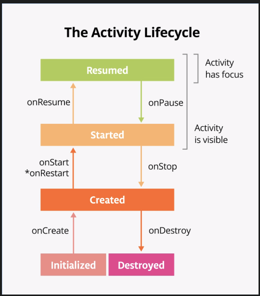

### Architecture
---

#### Good Practice
- Project pane, open the strings.xml file from the path `app > res > values > strings.xml`
```xml
    <resources>
    <string name="name"> .... </string>
    </resources>
```
```kotlin
    //This avoid tight couple to our application
    val names = stringResourse(R.string.name)
```

#### Alignment, Arrangement of Box, Row, Column
To set children's position within a `Row`, set the `horizontalArrangement` and `verticalAlignment` arguments. For a `Column`, set the `verticalArrangement` and `horizontalAlignment` arguments.
```kotlin
    //syntax
    // Arranging the item center Vertically
    Column(
        verticalArrangement = Arrangement.Center, 
    ){
        //....
    }
    Box(
        contentAlignment = Alignment.Center, //centerning the elements
    ){
        //....
    }
```


#### Modifiers
- __Padding__:  It give some `thickness` or some `width inside` the Composable
```kotlin
    // This is an example. 
    Modifier.padding(
        start = 16.dp,
        top = 16.dp,
        end = 16.dp,
        bottom = 16.dp
    )
    //or
    Modifier.padding(20.dp)
```
- __Border__: border with round corner
```kotlin
    .border(
            2.dp, 
            Color.Red, 
            RoundedCornerShape(8.dp),
        )
```

#### Activity life cycle


```kotlin
class MainActivity : ComponentActivity(){
    override fun onCreate(){
        //..
    }
    override fun onStop(){
        //..
    }
}
```

---